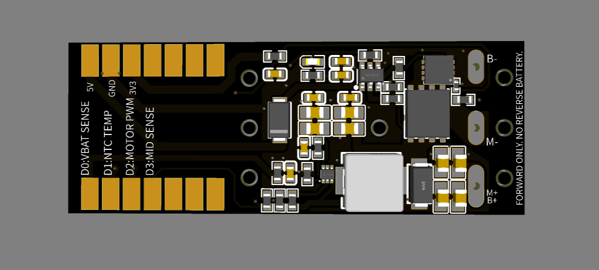
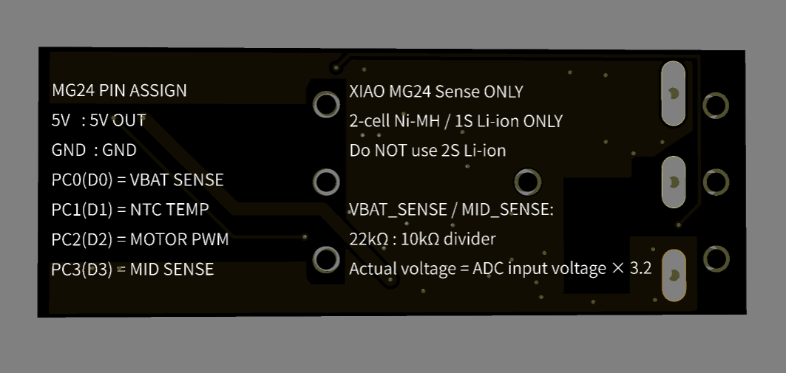
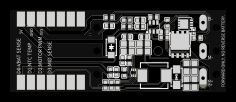
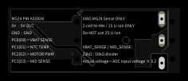

# ミニ四駆AI モータードライバ基板

**XIAO MG24 Sense専用 / 正転専用 / ショートブレーキ対応 MOSFETドライバ**

本リポジトリは、ミニ四駆に電子制御を追加するための  
**XIAO MG24 Sense専用モータードライバ基板 v0.3** の説明・接続方法・注意事項・サポート情報をまとめたものです。

> **対象者**  
> はんだ付け、電子工作、モーター制御の基礎知識がある方向けの基板です。  
> 完成品の民生機器ではなく、**改造・競技・研究・教育用途を想定した電子工作部品**です。

---

## 基板レンダリング

製造予定基板の3Dレンダリング画像です。  
実物写真は、完成基板の到着後に追記予定です。

### 表面



### 裏面



---

## 基板外観

GitHub上で拡大して確認できるよう、基板の表面・裏面を実寸大の大きさでのSVGで掲載しています。  
裏面は、シルク印刷の文字が読みやすい向きになるよう**180度回転した画像**を掲載しています。

### 表面



### 裏面



---

## 概要

本基板は、ミニ四駆における

```text
M+ / B+ = 電池＋ / モーター＋ 共通
M-      = モーター−
B-      = 電池−
```

という構造を前提にした、**正転専用・M-側制御**の高電流モータードライバです。

一般的なHブリッジ型ドライバではなく、

- **Nch MOSFETによるモーター駆動**
- **Pch MOSFETによるショートブレーキ**
- **1本のPWM信号による駆動 / 制動切り替え**
- **XIAO MG24 Senseへの5V給電**
- **電池電圧・M-側電圧・基板温度の観測**

を1枚の基板にまとめています。

---

## この基板でできること

- ミニ四駆用ブラシモーターの**高電流駆動**
- PWMによる出力調整
- **ショートブレーキ**による減速制御
- XIAO MG24 Senseを使ったIMU制御・BLE制御との統合
- 電池電圧の観測
- モーターM-側電圧の観測
- ドライバ基板温度の観測
- LC、スロープ、コーナー前などでの速度制御実験

---

## 設計思想

本基板は、汎用モータードライバではありません。

**ミニ四駆AI制御に必要な機能へ絞り込んだ、専用設計のモータードライバ**です。

特に重視したのは、次の4点です。

1. **1セル系電源で強く駆動できること**
2. **短時間で効くショートブレーキを扱えること**
3. **XIAO MG24 Senseと組み合わせて実装しやすいこと**
4. **電圧・温度をソフトウェアから観測できること**

ミニ四駆AIでは、単にモーターを回すだけでなく、

- 区間ごとの速度制御
- LCやスロープ前の減速
- ショートブレーキを使った姿勢・速度制御
- バッテリー状態の観測
- ドライバ基板温度の監視

が重要になります。  
本基板は、そうした用途を前提に設計しています。

---

## 駆動性能について

本基板は、一般的な小型モータードライバICではなく、  
**低オン抵抗MOSFETと専用ゲートドライバを用いた、ミニ四駆用ブラシモーター向け高電流ドライバ**として設計しています。

手元評価では、  
**DRV8835搭載の小型モータードライバでは電流制限により起動・駆動できなかったミニ四駆用モーターについても、本基板では駆動できることを確認しています。**

これは、本基板が

- 低抵抗MOSFETによる大電流経路
- 専用ゲートドライバによる5Vゲート駆動
- ミニ四駆向けに正転駆動とショートブレーキへ機能を絞った構成

を採用しているためです。

ただし、実際の駆動可否や発熱は、

- 使用するモーター
- 電池
- 配線抵抗
- 配線長
- PWM Duty
- ショートブレーキ時間
- 車体負荷

によって変化します。

**最大連続電流・最大ピーク電流を一律に保証するものではありません。**  
必要に応じて、実機評価に基づく電流・温度特性を今後追記します。

---

## 主な特徴

- **XIAO MG24 Sense専用設計**
- **正転専用**。逆転制御には非対応
- **M+ / B+ 共通、M-側制御**
- **Nch MOSFETによる低側駆動**
- **Pch MOSFETによるショートブレーキ**
- **PWM入力1本で駆動とブレーキを制御**
- **UCC27511ゲートドライバによる5Vゲート駆動**
- **TPS61023による5V昇圧電源**
- **XIAO MG24 Senseへの5V給電**
- **5Vラインの逆流対策を実装**
- **VBAT_SENSEによる電池およびM+電圧観測**
- **MID_SENSEによるM-側電圧観測**
- **NTC TEMPによる基板温度観測**
- **Ni-MH 2セル / Li-ion 1セル向け**
- **基板表面・裏面に配線情報と注意事項をシルク印刷**
- **DRV8835系ドライバでは電流制限により駆動できなかったモーターの駆動を手元評価で確認**

---

## 重要な注意事項

使用前に必ず確認してください。

```text
・XIAO MG24 Sense専用です
・XIAO MG24 Senseは付属しません
・正転専用です
・逆転制御はできません
・Hブリッジではありません
・PWM Duty 0%ではショートブレーキになります
・電池の逆接続は禁止です
・Li-ion 2セルは禁止です
・8.4V系電源は禁止です
・FM-A / SFMシャーシには基本的に非対応です
・フェンスカー等の電池逆向き運用には、そのまま使用できません
・特殊な改造車両では使用できない場合があります
・取り付け、配線、絶縁、固定は使用者側で確認してください
```

---

## 基本仕様

| 項目 | 内容 |
|---|---|
| 製品名 | ミニ四駆AI モータードライバ基板 v0.3 |
| 対応マイコン | XIAO MG24 Sense専用 |
| 駆動方式 | 正転専用、M-側制御 |
| モーター制御 | Nch MOSFET低側駆動 |
| ブレーキ | Pch MOSFETによるショートブレーキ |
| 制御信号 | PWM入力 1本 |
| ゲート駆動 | UCC27511による5Vゲート駆動 |
| 想定電源 | Ni-MH 2セル / Li-ion 1セル |
| 非対応電源 | Li-ion 2セル、8.4V系電源 |
| 電池 / M+電圧観測 | VBAT_SENSE |
| M-側電圧観測 | MID_SENSE |
| 基板温度観測 | NTC TEMP |
| 基板サイズ | 約 55 mm × 21 mm |
| 基板厚 | 1.2 mm |
| 推奨大電流配線 | 18AWG、短距離なら20AWGも可 |
| 対象 | 電子工作・模型改造に慣れた方向け |

---

## 接続端子

### 大電流端子

```text
M+ / B+ = 電池＋ / モーター＋ 共通
M-      = モーター−
B-      = 電池−
```

### 駆動時の電流経路

```text
M+ / B+ → モーター → M- → Nch MOSFET → B-
```

### ショートブレーキ時の経路

```text
M- → Pch MOSFET → M+ / B+
```

---

## XIAO MG24 Senseとのピン対応

本基板は、**XIAO MG24 Sense専用のピン割り当て**で設計しています。

| XIAO MG24 Sense | 本基板での機能 |
|---|---|
| 5V | 5V OUT |
| GND | GND |
| PC0（D0） | VBAT SENSE |
| PC1（D1） | NTC TEMP |
| PC2（D2） | MOTOR PWM |
| PC3（D3） | MID SENSE |

XIAO MG24 Senseの概要・ピン情報は、Seeed Studio公式ドキュメントを参照してください。

- [Seeed Studio XIAO MG24(Sense) 入門ガイド](https://wiki.seeedstudio.com/ja/xiao_mg24_getting_started/)

---

## 動作原理

本基板は、Nch MOSFETとPch MOSFETを使って、

- **モーターへの通電**
- **モーター端子の短絡によるブレーキ**

を切り替えます。

### 駆動

Nch MOSFETをONすることで、

```text
電池＋ → モーター → Nch MOSFET → 電池−
```

の電流経路を作ります。

### ショートブレーキ

Pch MOSFETをONすることで、モーター端子間を高側で短絡し、

```text
M- → Pch MOSFET → M+
```

の経路を作ります。

回転中のブラシモーターは発電機として振る舞うため、端子を短絡すると反力が生じ、減速がかかります。

---

## PWM制御の解釈

本基板は、1本のPWM信号で **駆動** と **ショートブレーキ** を切り替えます。

```text
PWM Duty 100%：連続駆動
PWM Duty   0%：連続ショートブレーキ
中間Duty      ：PWM周期内で駆動とショートブレーキを切り替え、出力を調整
```

一般的な「PWM OFF区間でモーターをフリー回転させる」ドライバとは異なり、

> **本基板では、中間Duty時のPWM OFF区間もショートブレーキ側に働きます。**

そのため、中間Dutyは単なる惰性駆動ではなく、

- 駆動
- 制動

を高速に切り替える制御になります。

---

## 主要部品と採用理由

### Nch MOSFET: SiSS64DN-T1-GE3

- 用途: **モーター駆動用Nch MOSFET**
- メーカー: Vishay
- パッケージ: PowerPAK 1212-8S
- VDS: 30 V
- RDS(on): 最大 2.86 mΩ @ VGS = 4.5 V
- Qg: 21 nC typ.

低オン抵抗で、1セル系電源でも損失を抑えながらモーター電流を扱う目的で採用しています。

- [Vishay SiSS64DN データシート](https://www.vishay.com/docs/67294/siss64dn.pdf)

---

### Pch MOSFET: SI7137DP-T1-GE3

- 用途: **ショートブレーキ用Pch MOSFET**
- メーカー: Vishay
- パッケージ: PowerPAK SO-8
- VDS: -20 V
- 低オン抵抗のPch MOSFETを採用

ブレーキ時にM-側をM+側へ短絡するための高側Pch MOSFETです。

- [Vishay SI7137DP データシート](https://www.vishay.com/doc/?69063=)

---

### ゲートドライバ: UCC27511DBVR

- 用途: **MOSFETゲート駆動**
- メーカー: Texas Instruments
- 動作電圧範囲: 4.5 V ～ 18 V
- 4 A peak source / 8 A peak sink
- split output構成により、立ち上がり・立ち下がりのゲート抵抗を個別に設定可能

本基板では、XIAO MG24 SenseのPWM信号を直接MOSFETゲートへ入れるのではなく、UCC27511で受けてゲートを駆動します。

これにより、

- MOSFETのゲート充放電を強く行う
- 5Vゲート駆動を実現する
- スイッチング遷移を安定させる

ことを狙っています。

- [TI UCC27511 データシート](https://www.ti.com/lit/gpn/UCC27511)
- [TI UCC27511 製品ページ](https://www.ti.com/product/UCC27511)

---

### 5V昇圧DCDC: TPS61023DRLR

- 用途: **5V系電源生成**
- メーカー: Texas Instruments
- 入力電圧範囲: 0.5 V ～ 5.5 V
- 起動時最低入力電圧: 1.8 V
- 出力設定範囲: 2.2 V ～ 5.5 V
- 3.7 A valley switching current limit typ.

本基板では、Ni-MH 2セルまたはLi-ion 1セルから5Vを生成し、

- UCC27511のゲートドライブ電源
- XIAO MG24 Senseへの5V供給

に使用します。

- [TI TPS61023 データシート](https://www.ti.com/lit/ds/symlink/tps61023.pdf)
- [TI TPS61023 製品ページ](https://www.ti.com/product/TPS61023)

---

### 温度センサ: NTCG104BH103JT1

- 用途: **基板温度観測**
- メーカー: TDK
- 抵抗値: 10 kΩ @ 25°C
- 抵抗許容差: ±5%
- B定数: 4100 K typ. @ 25/85°C
- B定数許容差: ±3%

本基板では、NTCサーミスタと10kΩ固定抵抗で分圧を作り、XIAO MG24 SenseのADCで基板周辺の温度変化を観測します。

- [TDK NTCG104BH103JT1 製品ページ](https://product.tdk.com/en/search/sensor/ntc/chip-ntc-thermistor/info?part_no=NTCG104BH103JT1)

---

## 5V給電と逆流対策

XIAO MG24 Senseの5Vピンは、外部から電源入力として使用できますが、Seeed公式ドキュメントでは、USB給電との競合を避けるために**逆流防止用ダイオード**を入れるよう説明されています。

本基板では、XIAO MG24 Senseへの5V供給ラインに逆流対策を実装しています。

- [Seeed Studio XIAO MG24(Sense) 入門ガイド](https://wiki.seeedstudio.com/ja/xiao_mg24_getting_started/)

---

## センス信号

### VBAT_SENSE

**電池＋およびモーターM+側の共通ノード電圧**を観測するための信号です。

用途例:

- 電池残量の目安
- 負荷時の電圧降下観測
- 走行中の電源状態記録

---

### MID_SENSE

**モーターM-側の電圧**を観測するための信号です。

M-はMOSFETでスイッチングされるノードであり、

- 駆動時
- ショートブレーキ時
- PWM中間Duty時

で波形が変化します。

用途例:

- M-側電圧の観測
- 駆動状態のデバッグ
- 独自の制御・解析実験

---

### NTC TEMP

基板上の温度変化を観測するための信号です。

本基板では、

```text
10kΩ固定抵抗 + 10kΩ NTCサーミスタ
```

による分圧回路を構成し、ADCで読み取ります。

温度換算は、採用しているNTCのB定数を用いてソフトウェア側で行います。

---

## VBAT_SENSE / MID_SENSE の換算式

VBAT_SENSEとMID_SENSEは、いずれも

```text
22kΩ : 10kΩ
```

の抵抗分圧を使っています。

分圧後電圧を `V_ADC`、実際のノード電圧を `V_REAL` とすると、

```text
V_REAL = V_ADC × (22k + 10k) / 10k
       = V_ADC × 3.2
```

です。

基板裏面にも、

```text
Actual voltage = ADC input voltage × 3.2
```

とシルク印刷しています。

---

## NTC温度換算

### 前提値

採用NTC:

- 型番: `NTCG104BH103JT1`
- `R0 = 10,000 Ω` @ 25°C
- `T0 = 25°C = 298.15 K`
- `B = 4100 K`（25/85°C typ.）

### 抵抗値から温度を求める式

B定数近似では、NTC温度は次式で求めます。

```text
T[K] = 1 / { 1/T0 + (1/B) × ln(R_NTC / R0) }
T[°C] = T[K] - 273.15
```

ここで、

```text
T0    = 298.15 K
R0    = 10000 Ω
B     = 4100 K
R_NTC = 現在のNTC抵抗値
```

です。

### ADC電圧からNTC抵抗値を求める

NTC分圧回路は、基板実装に合わせて扱います。代表的な2パターンを示します。

#### パターンA: 3V3 → 固定抵抗 → ADC → NTC → GND

```text
3V3
 │
R_FIXED = 10kΩ
 │── V_ADC
NTC
 │
GND
```

この場合、

```text
R_NTC = R_FIXED × V_ADC / (V_REF - V_ADC)
```

です。

#### パターンB: 3V3 → NTC → ADC → 固定抵抗 → GND

```text
3V3
 │
NTC
 │── V_ADC
R_FIXED = 10kΩ
 │
GND
```

この場合、

```text
R_NTC = R_FIXED × (V_REF / V_ADC - 1)
```

です。

実装回路に合わせて、使用する式を選択してください。

### 参考実装例

```cpp
#include <math.h>

constexpr float R0 = 10000.0f;      // 10kΩ @ 25°C
constexpr float T0 = 298.15f;       // 25°C in Kelvin
constexpr float BETA = 4100.0f;     // NTCG104BH103JT1, B25/85 typ.

float ntcResistanceToTemperatureC(float rNtc) {
  const float tempK = 1.0f /
    (1.0f / T0 + (1.0f / BETA) * logf(rNtc / R0));
  return tempK - 273.15f;
}
```

---

## 推奨配線材

モーター電流が流れる以下の配線には、**18AWGを推奨**します。

```text
M+ / B+
M-
B-
```

配線長を十分短くできる場合は、**20AWG程度でも使用可能**です。

細い配線や長い配線は、

- 電圧降下
- 発熱
- 駆動力低下
- ブレーキ性能低下

の原因になります。

特に、

```text
M-
B-
```

は、できるだけ**短く・太く**配線してください。

---

## 対応シャーシ

本基板は、通常のミニ四駆における

> **電池＋端子とモーター＋端子が共通になる構造**

を前提にしています。

### 対応想定シャーシ

- VZシャーシ
- VSシャーシ
- ARシャーシ
- S2シャーシ
- MSシャーシ
- MAシャーシ

### 非対応シャーシ

- FM-Aシャーシ
- SFMシャーシ

FM-A / SFMシャーシは、フロントモーター構造およびターミナル配置の都合により、本基板の想定する接続と合わないため、基本的に非対応です。

---

## フェンスカー等の特殊構成について

フェンスカー等の特殊構成では、

> **進行方向を決めるために電池を通常と逆向きに入れる運用**

が行われる場合があります。

本基板は、

```text
M+ / B+ = 電池＋ / モーター＋ 共通
M-      = モーター−
B-      = 電池−
```

を前提とした、**逆接続禁止の正転専用基板**です。

そのため、

> **電池を逆向きに入れて進行方向を決める車両には、そのまま使用できません。**

フェンスカー等で使用する場合は、車体側の電源極性、モーター極性、進行方向の関係を十分に理解したうえで、使用者自身の責任で適合性を判断してください。

---

## 取り付け上の注意

推奨する取り付け方針:

```text
・電池端子、モーター端子から短く太く配線する
・大電流配線には18AWGを推奨
・短距離配線に限り20AWG程度も可
・M-とB-の配線を特に短くする
・配線は走行中に動かないよう固定する
・金属部との接触を避ける
・必要に応じてカプトンテープ等で絶縁する
・XIAO MG24 Sense実装時は向きとピン位置を必ず確認する
```

基板や配線がシャーシ、ターミナル、モーターケース、電池端子等に接触すると、ショートや故障の原因になります。

---

## 付属しないもの

以下は別途ご用意ください。

```text
・XIAO MG24 Sense
・モーター
・電池
・車体
・配線材
・工具
・はんだ
・ファームウェア書き込み済みマイコン
```

---

## 想定用途

- ミニ四駆AI制御の実験
- IMUやBLEマイコンを用いた走行制御
- コーナー、LC、スロープ前の減速制御
- PWMによる出力調整
- ショートブレーキによる姿勢・速度制御
- 電池 / M+電圧の観測
- M-側電圧の観測
- 基板温度の監視
- 教育・ワークショップ・研究用途

---

## サポート

本基板に関する不具合報告・質問・改善提案は、GitHubの **Issues** を使用してください。

### 問い合わせ時に記載してほしい情報

再現性のある確認を行うため、可能な範囲で以下を記載してください。

- 使用している基板バージョン
- 使用マイコンの種類
- 使用電池の種類
- 使用モーター
- 配線写真
- 症状の詳細
- 再現手順
- 使用しているファームウェアまたはコード
- 発熱、異音、停止などの有無

### サポート対象外になりやすい例

次のような場合は、個別の復旧・保証対応が難しい場合があります。

- 逆接続
- 過電圧印加
- Li-ion 2セル接続
- 配線ミス
- はんだ不良
- ショート
- モーター過負荷
- 車体への取り付け不良
- 走行中の衝撃・振動・接触による破損
- 改造後の故障

---

## 免責事項

本基板は、改造・競技・研究・教育用途を想定した電子工作向け部品です。

使用には、

- はんだ付け
- 配線
- 絶縁
- 電源極性
- MOSFET
- モーター制御

に関する基礎知識が必要です。

以下の場合、返品・交換・補償の対象外とします。

```text
・逆接続
・過電圧印加
・Li-ion 2セル接続
・ショート
・配線ミス
・はんだ不良
・モーター過負荷
・車体への取り付け不良
・走行中の衝撃、振動、接触による破損
・改造後の故障
```

本基板を使用したことによる車体、モーター、電池、マイコン、その他部品の破損、走行不能、コースアウト、事故等について、販売者は責任を負いません。

---

## 商標について

- ミニ四駆は株式会社タミヤの登録商標です。
- 本基板は株式会社タミヤの公式製品・公認製品ではありません。
- 本基板は個人開発の改造・実験用基板です。
