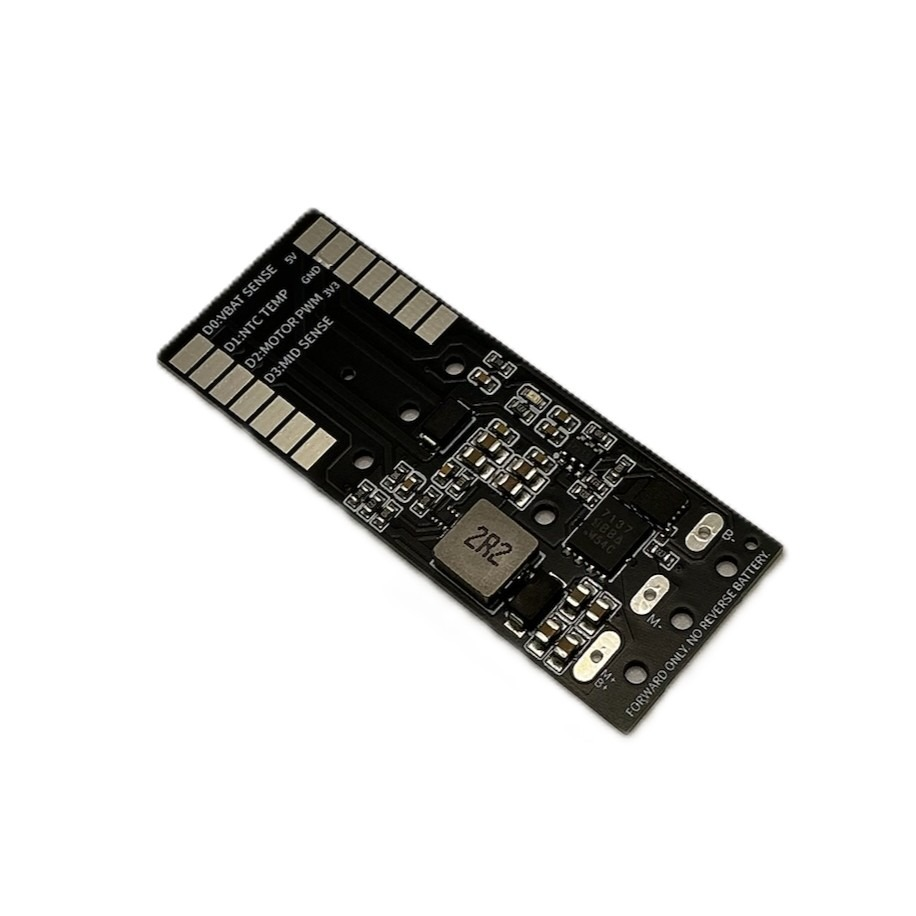
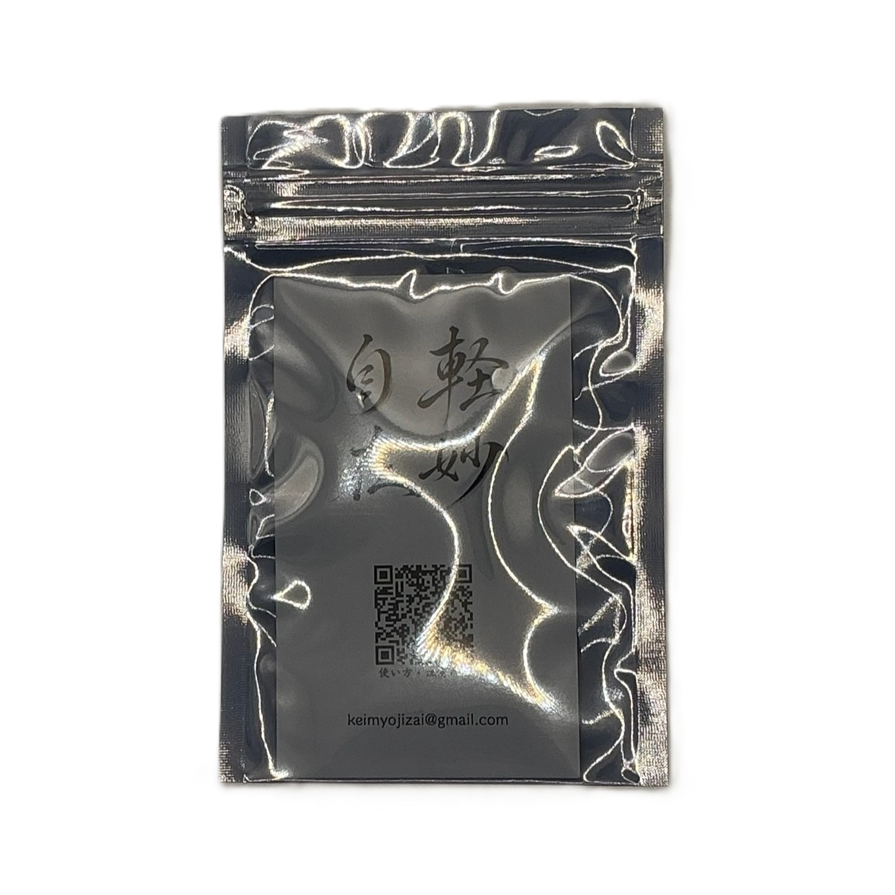
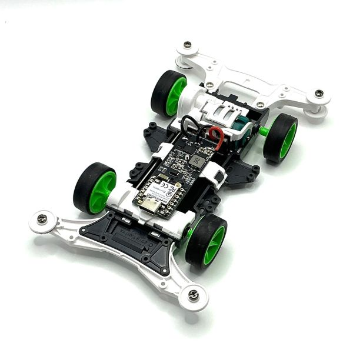

# ミニ四駆AI モータードライバ基板

**XIAO MG24 Sense専用 / 正転専用 / ショートブレーキ対応 MOSFETドライバ**

ミニ四駆に電子制御を追加するための、  
**XIAO MG24 Sense専用 高電流モータードライバ基板**です。

- **Nch MOSFETによるモーター駆動**
- **Pch MOSFETによるショートブレーキ**
- **1本のPWM信号で駆動 / 制動を切り替え**
- **発進時のソフトスタートに対応**
- **電池電圧・M-側電圧・基板温度の観測に対応**
- **Ni-MH 2セル / Li-ion 1セル向け**

> 本基板は、改造・競技・研究・教育用途を想定した電子工作向け部品です。  
> はんだ付け、配線、電源極性、モーター制御に関する基礎知識が必要です。

---

## 購入後に使用するもの

本基板を使用するには、XIAO MG24 Senseへ専用ファームウェアを書き込み、WebアプリからBLE接続して設定・走行制御を行います。

- [Webアプリを開く](https://keimyojizai.github.io/mini4wd-motor-driver/)
- [Windows書き込みツールをダウンロード](https://github.com/keimyojizai/mini4wd-motor-driver/releases/latest)
- [ファームウェア更新手順](docs/firmware_update.md)
- [本体へ保存とスタンドアローン起動](docs/standalone_mode.md)
- [Arduino IDEで手動書き込みする手順](docs/flash_arduino_ide.md)
- [書き込みに失敗した場合の復旧手順](docs/recovery.md)

### Webアプリでできること

- デバイスへのBLE接続
- 走行開始・停止
- 認識調整
- ルール設定
- 電圧補正設定
- ラップタイム確認
- 停止後ログ確認
- ヘッダー非表示による走行・ラップ表示の拡大
- ファームウェアバージョン確認
- BLE表示名の変更
- 現在の設定を本体へ保存
- 保存済み設定によるスタンドアローン起動

### 初回ファームウェア書き込み

初回使用時、またはファームウェア更新時は、Windows用書き込みツールを使用してください。

1. GitHub ReleasesからWindows用書き込みツールをダウンロードします。
2. ZIPを右クリックして「すべて展開」します。
3. 展開したフォルダ内の `RUN_ME_FIRST_Flash_Mini4AI_Windows.bat` を実行します。
4. 書き込み時に、BLE表示名を自由に設定できます。

> ファームウェア書き込み時は、**ミニ四駆側の電源をオフ** にしてからUSB接続してください。

macOS / Linux用の書き込みツールは、現時点では動作確認対象外のため同梱していません。Windows用書き込みツールでうまくいかない場合や、他OSで使用する場合はArduino IDEで手動書き込みしてください。

### 本体へ保存とスタンドアローン起動

Webアプリで設定した内容には、**一時適用**と**本体へ保存**があります。

- **走行開始**: 現在の画面設定を一時的に本体へ送信して走行します。電源を切ると、この一時設定は残りません。
- **本体へ保存**: 現在のパラメータ、ルール、電圧補正、周回認識設定をXIAO MG24 Sense本体へ保存します。
- **スタンドアローン起動**: 保存済み設定がある状態で、裏返しのまま電源ON → 表向きに戻す → 約3秒後にBLEなしで自動スタートします。

スタンドアローン起動で使いたい設定は、必ずWebアプリの **「本体へ保存」** を押してから使用してください。

Webアプリでは、誤操作を避けるため「走行開始」「停止」とは離した位置に **本体へ保存** ボタンを配置しています。走行コントロール欄とルール設計欄の保存ボタンは同じ機能です。

詳細は [本体へ保存とスタンドアローン起動](docs/standalone_mode.md) を参照してください。

### 推奨バージョン

| 項目 | 推奨バージョン |
|---|---|
| Webアプリ | v4.21-r15 |
| ファームウェア | v3.58-r10 |

Webアプリ上で、接続中デバイスのファームウェアバージョンを確認できます。

---

## 外観・パッケージ・装着例

### 基板単体



### 販売パッケージ



### ミニ四駆への装着例



> 装着例です。ミニ四駆車体、XIAO MG24 Sense、モーター、電池、配線材等は付属しません。

### 動作例

[YouTube Shortsで動作例を見る](https://youtube.com/shorts/a6D7kiM3N_Y?feature=share)

---

## どのような基板か

本基板は、ミニ四駆で一般的な

```text
M+ / B+ = 電池＋ / モーター＋ 共通
M-      = モーター−
B-      = 電池−
```

という構成を前提にした、**正転専用・M-側制御**のモータードライバです。

Hブリッジではなく、機能を

- **正転駆動**
- **ショートブレーキ**
- **各種センシング**

に絞ることで、ミニ四駆AI制御向けに小型化と高電流駆動を狙っています。

---

## 主な特徴

- **XIAO MG24 Sense専用設計**
- **正転専用**。逆転制御には非対応
- **Nch MOSFETによる低側駆動**
- **Pch MOSFETによるショートブレーキ**
- **UCC27511による5Vゲート駆動**
- **TPS61023による5V昇圧電源**
- **XIAO MG24 Senseへの5V給電**
- **VBAT / MID / 温度の観測に対応**
- **発進時のソフトスタートに対応**
- **DRV8835系ドライバでは駆動できなかったモーターの駆動を手元評価で確認**

---

## ソフトウェア制御について

本基板は、XIAO MG24 Sense上のファームウェアでモーターを制御します。

- 走行開始時は、設定されたDutyへ一気に上げず、短時間のソフトスタートを行います。
- 走行中のルール判定、ブレーキ、低出力制御は本体側で実行されます。
- Webアプリは、設定・開始/停止指示・ログ確認を行うための操作画面です。
- Webアプリの走行開始は、現在の画面設定を一時適用します。
- スタンドアローン起動で使う設定は、Webアプリの **「本体へ保存」** を押したときだけ更新されます。
- BLE接続が切れても、走行中の制御判断は本体側で継続します。

---

## 重要な注意事項

使用前に必ず確認してください。

```text
・XIAO MG24 Sense専用です
・XIAO MG24 Senseは付属しません
・正転専用です
・逆転制御はできません
・Hブリッジではありません
・PWM Duty 0%ではショートブレーキになります
・電池の逆接続は禁止です
・Li-ion 2セルは禁止です
・8.4V系電源は禁止です
・FM-A / SFMシャーシには基本的に非対応です
・フェンスカー等の電池逆向き運用には、そのまま使用できません
・ファームウェア書き込み時は、ミニ四駆側の電源をオフにしてからUSB接続してください
```

---

## 基本仕様

| 項目 | 内容 |
|---|---|
| 対応マイコン | XIAO MG24 Sense専用 |
| 駆動方式 | 正転専用、M-側制御 |
| モーター制御 | Nch MOSFET低側駆動 |
| ブレーキ | Pch MOSFETによるショートブレーキ |
| 制御信号 | PWM入力 1本 |
| 想定電源 | Ni-MH 2セル / Li-ion 1セル |
| 非対応電源 | Li-ion 2セル、8.4V系電源 |
| 基板サイズ | 約 55 mm × 21 mm |
| 基板厚 | 1.2 mm |

---

## 接続概要

### 大電流端子

```text
M+ / B+ = 電池＋ / モーター＋ 共通
M-      = モーター−
B-      = 電池−
```

### XIAO MG24 Senseとのピン対応

| XIAO MG24 Sense | 本基板での機能 |
|---|---|
| 5V | 5V OUT |
| GND | GND |
| PC0（D0） | VBAT SENSE |
| PC1（D1） | NTC TEMP |
| PC2（D2） | MOTOR PWM |
| PC3（D3） | MID SENSE |

---

## 詳細ドキュメント

READMEでは概要のみを示しています。  
設計意図・配線・動作原理・注意事項の詳細は、以下を参照してください。

- [ファームウェア更新手順](docs/firmware_update.md)
- [本体へ保存とスタンドアローン起動](docs/standalone_mode.md)
- [Arduino IDEで手動書き込みする手順](docs/flash_arduino_ide.md)
- [書き込みに失敗した場合の復旧手順](docs/recovery.md)
- [トラブルシュート](docs/troubleshooting.md)
- [ハードウェア仕様と主要部品](docs/hardware_spec.md)
- [配線・取り付け・対応シャーシ](docs/wiring_and_usage.md)
- [PWM制御とショートブレーキの動作](docs/pwm_and_brake.md)
- [安全上の注意・免責事項・サポート](docs/safety_and_support.md)

---

## サポート

不具合報告・質問・改善提案は、GitHubの **Issues** を使用してください。  
問い合わせ時は、以下の情報を記載してください。

- 使用しているWebアプリのバージョン
- 使用しているファームウェアのバージョン
- XIAO MG24 SenseのBLE表示名
- 使用電源
- 使用モーター
- 症状が起きた操作手順
- 可能であれば、Webアプリの停止後ログ

---

## 商標について

- ミニ四駆は株式会社タミヤの登録商標です。
- 本基板は株式会社タミヤの公式製品・公認製品ではありません。
- 本基板は個人開発の改造・実験用基板です。
