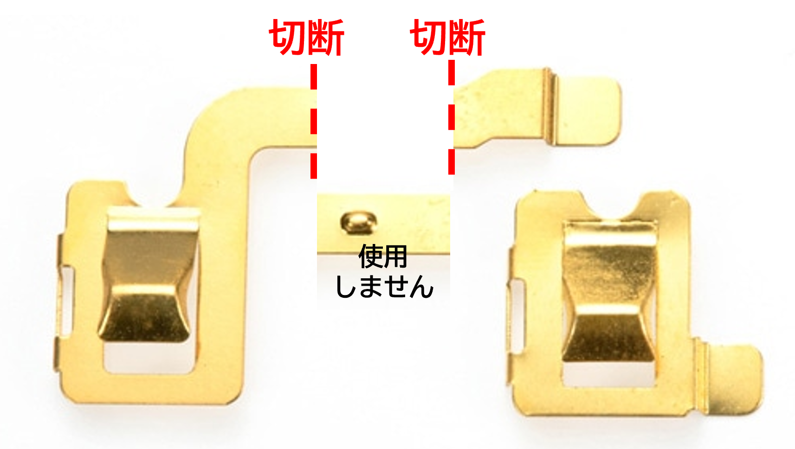
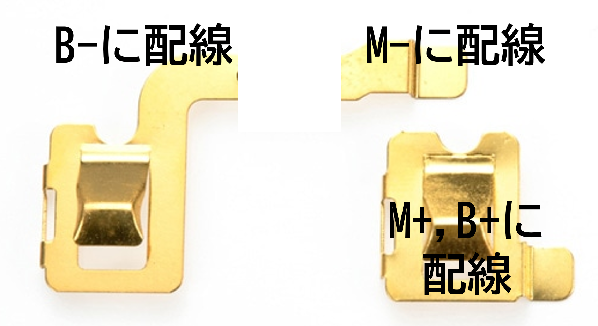
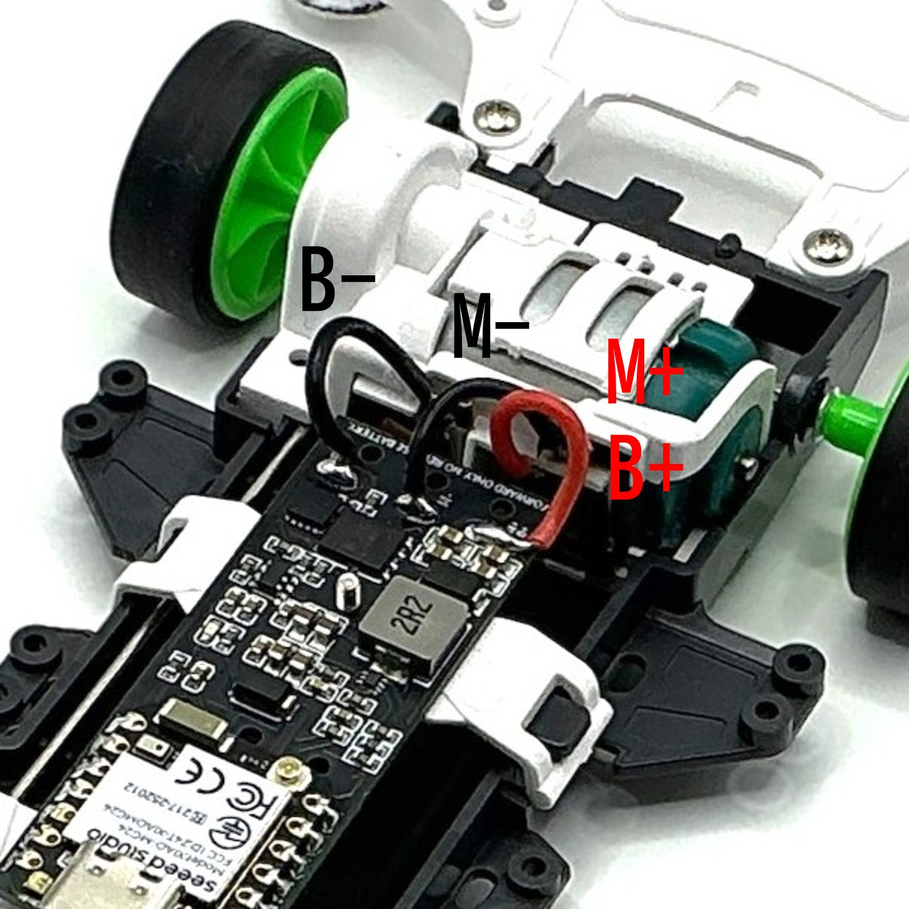

# 配線・取り付け・対応シャーシ

[← READMEへ戻る](../README.md)

---

## 接続端子

### 大電流端子

```text
M+ / B+ = 電池＋ / モーター＋ 共通
M-      = モーター−
B-      = 電池−
```

### 駆動時の電流経路

```text
M+ / B+ → モーター → M- → Nch MOSFET → B-
```

### ショートブレーキ時の経路

```text
M- → Pch MOSFET → M+ / B+
```

---

## ターミナル加工と配線例

以下は、通常のミニ四駆用ターミナルを加工し、本基板へ配線する場合の一例です。  
使用するシャーシやターミナル形状により加工位置が変わる可能性があります。実際の導通は、必ずテスターで確認してください。

> **注意**  
> 電池端子、モーター端子、基板が意図せずショートすると、基板・電池・モーターを破損する可能性があります。配線後は、電池を入れる前に必ず導通確認を行ってください。

### 手順1: ターミナル加工

赤い破線で示した部分を切断します。中央の不要な端子部分は使用しません。
ラジオペンチやニッパー等を用いて、端子を変形させすぎないように加工してください。折り曲げて切り離す場合は、切断面のバリや金属片を取り除き、他の端子と接触しないことを確認してください。



### 手順2: ターミナルへの配線

加工したターミナルに対して、以下のようにはんだづけして配線します。

```text
B-      = 電池−側ターミナルへ配線
M-      = モーター−側ターミナルへ配線
M+ / B+ = 電池＋ / モーター＋ 共通側ターミナルへ配線
```



### 基板への配線例

ターミナル側から取り出した配線を、本基板の各端子へはんだづけして接続します。

```text
B-      → 基板の B- 端子
M-      → 基板の M- 端子
M+ / B+ → 基板の M+ / B+ 端子
```

大電流が流れるため、配線はできるだけ短く、太くすることが理想です。  
推奨配線材は18AWGです。短距離であれば20AWG程度も使用可能ですが、配線抵抗や発熱を必ず確認してください。



---

## XIAO MG24 Senseとのピン対応

本基板は、**XIAO MG24 Sense専用のピン割り当て**で設計しています。

| XIAO MG24 Sense | 本基板での機能 |
|---|---|
| 5V | 5V OUT |
| GND | GND |
| PC0（D0） | VBAT SENSE |
| PC1（D1） | NTC TEMP |
| PC2（D2） | MOTOR PWM |
| PC3（D3） | MID SENSE |

XIAO MG24 Senseの概要・ピン情報は、Seeed Studio公式ドキュメントを参照してください。

- [Seeed Studio XIAO MG24(Sense) 入門ガイド](https://wiki.seeedstudio.com/ja/xiao_mg24_getting_started/)

---

## 推奨配線材

モーター電流が流れる以下の配線には、**18AWGを推奨**します。

```text
M+ / B+
M-
B-
```

配線長を十分短くできる場合は、**20AWG程度でも使用可能**です。

細い配線や長い配線は、

- 電圧降下
- 発熱
- 駆動力低下
- ブレーキ性能低下

の原因になります。

特に、

```text
M-
B-
```

は、できるだけ**短く・太く**配線してください。

---

## 対応シャーシ

本基板は、通常のミニ四駆における

> **電池＋端子とモーター＋端子が共通になる構造**

を前提にしています。

### 対応想定シャーシ

- VZシャーシ
- VSシャーシ
- ARシャーシ
- S2シャーシ
- MSシャーシ
- MAシャーシ

### 非対応シャーシ

- FM-Aシャーシ
- SFMシャーシ

FM-A / SFMシャーシは、フロントモーター構造およびターミナル配置の都合により、本基板の想定する接続と合わないため、基本的に非対応です。

---

## フェンスカー等の特殊構成について

フェンスカー等の特殊構成では、

> **進行方向を決めるために電池を通常と逆向きに入れる運用**

が行われる場合があります。

本基板は、

```text
M+ / B+ = 電池＋ / モーター＋ 共通
M-      = モーター−
B-      = 電池−
```

を前提とした、**逆接続禁止の正転専用基板**です。

そのため、

> **電池を逆向きに入れて進行方向を決める車両には、そのまま使用できません。**

フェンスカー等で使用する場合は、車体側の電源極性、モーター極性、進行方向の関係を十分に理解したうえで、使用者自身の責任で適合性を判断してください。

---

## 取り付け上の注意

推奨する取り付け方針:

```text
・電池端子、モーター端子から短く太く配線する
・大電流配線には18AWGを推奨
・短距離配線に限り20AWG程度も可
・M-とB-の配線を特に短くする
・配線は走行中に動かないよう固定する
・金属部との接触を避ける
・必要に応じてカプトンテープ等で絶縁する
・XIAO MG24 Sense実装時は向きとピン位置を必ず確認する
```

基板や配線がシャーシ、ターミナル、モーターケース、電池端子等に接触すると、ショートや故障の原因になります。

---

## 付属しないもの

以下は別途ご用意ください。

```text
・XIAO MG24 Sense
・モーター
・電池
・車体
・配線材
・工具
・はんだ
・ファームウェア書き込み済みマイコン
```
